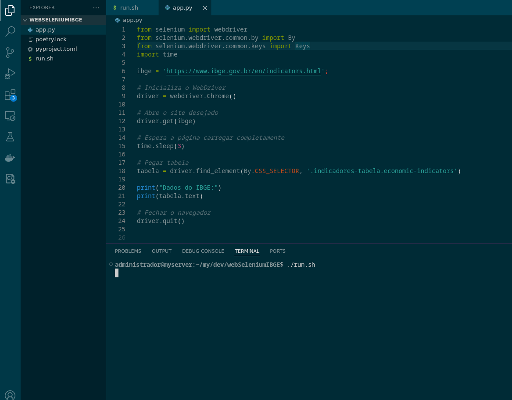

# Pegar indicadores via Selenium



    Pega os indicadores do IBGE

# Compilação e execução( Build )

```
poetry install
 ./run.sh
```
## Bibliotecas

* [selenium](https://pypi.org/project/selenium/) - Driver para Controlar um browser
* [poetry](https://python-poetry.org/) - Gerenciador de Dependencia

 


